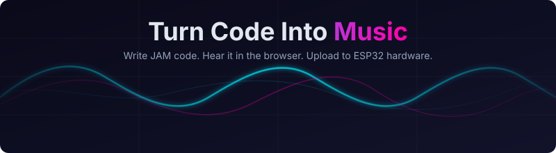

<p align="center">
  
</p>

# JAM Web

Interactive web editor for the JAM music DSL. Write music code, hear it in the browser, and upload to ESP32 hardware -- all from one page.

More about [JAM DSL compiler](https://github.com/Zer0Hiro/JAM-DSL-Compiler).

## Features

- **Code editor** with JAM syntax highlighting (CodeMirror + oneDark theme)
- **Browser playback** via in-browser Python compiler (Pyodide/WASM) with server fallback
- **ESP32 upload** with GPIO pin selector -- compile and flash directly from the browser
- **Simultaneous multi-instrument playback** via PATTERN beat-grid notation
- **Chords** with bracket notation `[C4 E4 G4]`
- **Per-note velocity** for dynamic expression (0–255)
- **Low-pass filter** with CUTOFF and RESONANCE per instrument
- **Reverb & Delay** effects with configurable feedback
- **Portamento (GLIDE)** for smooth pitch transitions
- **Stereo panning (PAN)** to place instruments in the stereo field
- **Dynamic BPM/VOLUME automation** for mid-song tempo and volume changes
- **C++ viewer** to inspect generated Mozzi 2.0 code
- **WAV download** for offline listening
- **Interactive lessons** teaching sound synthesis from scratch (EN + HE)
- **Sandbox mode** for free experimentation
- **JAMai chat assistant** for guided learning (RAG-based)
- **i18n** support (English, Hebrew)

For the full JAM language syntax, see the [JAM Documentation](https://zer0hiro.github.io/JAM-DSL-Compiler/).

## Architecture

```
jamWeb/
    public/
        dsl/                  Python compiler modules (served to Pyodide)
    src/
        App.jsx               Main app with lesson navigation
        components/
            CodeEditor.jsx    Editor + toolbar (play, upload, compile)
            LessonView.jsx    Lesson renderer with steps and challenges
            JAMai/            Chat assistant (local RAG)
        lessons/              Lesson content (EN)
        lessons/he/           Lesson content (HE)
        i18n/                 Translation strings
        utils/
            pyodideCompiler.js  In-browser Python compiler via Pyodide/WASM
    server/
        app.py                Flask backend (upload + fallback APIs)
        jamDsl/               JAM DSL Compiler (git submodule)
        jamai_chat_routes.py  JAMai chat API endpoints
        jamai_rag.py          RAG knowledge retrieval
```

## Setup

### 1. Clone with submodules

```bash
git clone --recursive https://github.com/Zer0Hiro/JAM-web-edition jamWeb
```

If already cloned without `--recursive`:

```bash
git submodule update --init --recursive
```

### 2. Frontend

```bash
cd jamWeb
npm install
npm run dev
```

Runs on `http://localhost:5173` with Vite HMR.

Play and Compile run entirely in the browser via Pyodide (Python-in-WASM). No backend needed for core features.

### 3. Backend (optional)

Only needed for ESP32 upload and JAMai chat assistant.

```bash
pip install flask flask-cors
python3 server/app.py
```

Runs on `http://localhost:5050`. Vite proxies `/api/*` to backend.

### ESP32 Upload

Requires:
- Backend server running
- PlatformIO installed (`pip install platformio`)
- ESP32 connected via USB
- On WSL2: `usbipd-win` for USB passthrough, user in `dialout` group

## How It Works

Compilation and WAV preview run client-side using [Pyodide](https://pyodide.org/) (Python compiled to WASM). On first use, the browser downloads the Pyodide runtime (~3.2MB, cached) and fetches the JAM compiler modules from `public/dsl/`. Subsequent compilations are instant with no network calls.

## API Endpoints (server, optional)

| Endpoint | Method | Description |
|----------|--------|-------------|
| `/api/upload` | POST | Compile + upload to ESP32 (accepts `pin` for GPIO selection) |
| `/api/jamai/chat` | POST | RAG chat assistant |
| `/api/health` | GET | Health check |

## Tech Stack

- React 18 + Vite
- Tailwind CSS
- CodeMirror 6
- Pyodide (Python-in-WASM for client-side compilation)
- Lucide icons
- Flask (backend, optional for core features)
- jamDsl compiler (Python)
- Mozzi 2.0 (audio synthesis on hardware)
